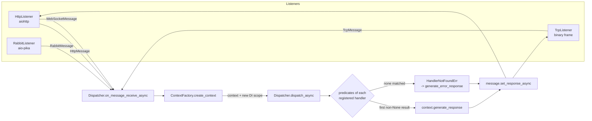

# Architecture: how a request flows

This page follows one request through BasisEdge 4.1: from the listener that accepts it, through
context selection and handler dispatch, to the response written back. It complements the short
lifecycle list in [README §7](../README.md#7-request-lifecycle); handler and predicate syntax is
covered in [README §8](../README.md#8-handlers) and [§10](../README.md#10-routing--predicates).

## The pipeline at a glance



Every listener hands a `Message` to the same entry point,
`Dispatcher.on_message_receive_async`. From there the path is identical for all transports:

1. `ContextFactory.create_context(message)` picks a context class and instantiates it.
2. `dispatch_async(context)` finds the handlers registered for exactly that context class and
   runs them in registration order until one returns something other than `None`.
3. If the message can carry a reply (it implements `IResponseBaseMessage`), the result is passed
   to `message.set_response_async`, and the listener turns it into an HTTP response or a TCP frame.

## Listeners and message types

Listeners are created by `ListenerFactory.load_listeners()` from the top-level option keys
`http`, `tcp` and `rabbitmq`. Each key accepts a single value or a list, so one process can listen
on several endpoints. Configuration details are in [README §18](../README.md#18-listeners-http--tcp--rabbit--ssl)
and [configuration-reference.md](configuration-reference.md).

| Listener | Message class | Carries a CMS object | Can reply |
|----------|---------------|----------------------|-----------|
| `HttpListener` (plain request) | `HttpMessage` | yes, built from the HTTP request | yes |
| `HttpListener` (`Upgrade: websocket`) | `WebSocketMessage` | yes, the CMS object of the opening request | no |
| `TcpListener` | `TcpMessage` | yes, the JSON payload of the frame | yes |
| `RabbitListener` | `RabbitMessage` | no | no |

Each message also has a `type` from `MessageType`: `CONNECT` (1), `MESSAGE` (2), `DISCONNECT` (3),
`AD_HOC` (4), `NOT_EXIST` (5). HTTP requests are `AD_HOC`. A WebSocket session produces a `CONNECT`
message when it opens, `MESSAGE` for every text, binary or error frame, and `DISCONNECT` when it
closes. A TCP frame carries its type in the first byte (see
[basiscore-integration.md](basiscore-integration.md#the-tcp-frame)).

Things worth knowing about each transport:

- **HTTP.** aiohttp receives every path and method (`/{tail:.*}`). `WebRequestHelper.create_cms_async`
  turns the request into a CMS object (`request`, `query`, `form`, `cookie`, `cms`), and the
  listener converts the returned CMS object back into an aiohttp response.
- **WebSocket.** An HTTP request with `Upgrade: websocket` is handed to the session manager
  instead. Handler return values are not sent anywhere; reply through `context.session` or
  `context.session_manager` (see [README §8.6](../README.md#86-websocket-handler)).
- **TCP.** Each connection carries one request frame and one reply frame. The listener reads a
  frame, dispatches it, writes the reply with the same type and session id, and closes the
  connection.
- **RabbitMQ.** Messages have no CMS object and no reply channel; the handler's return value is
  ignored by the transport.

## Choosing the context: the router

There is no router to configure in 4.x. The `ContextFactory` builds its routing table from the
handlers you register, and rebuilds it whenever handlers are added or removed
(`register_handler`, `unregister_handler`) and once more when the app starts.

**How the table is built.** For every handler registered for `RESTfulContext`, `HttpContext`,
`WebSocketContext`, `ClientSourceContext` or `ServerSourceContext`, the factory collects the
`Url` predicates of the handler (including ones nested in `app.all(...)` / `app.any(...)`). A
handler with no URL predicate contributes the wildcard `*`. The table maps each pattern to one
context class.

**How a message is matched.** For messages that carry a CMS object, the factory reads
`cms.request["full-url"]`, strips the host, port and query string to get the request path
(`www.example.com:8080/api/users/7?x=1` becomes `api/users/7`), and:

1. tests the path against every concrete pattern with the same rules the `Url` predicate uses
   during dispatch; the first match decides the context class;
2. if nothing matched and a wildcard exists, uses the wildcard's context class;
3. otherwise falls back by message class: `HttpMessage` and `TcpMessage` become `HttpContext`,
   `WebSocketMessage` becomes `WebSocketContext`, `RabbitMessage` becomes `RabbitContext`.

A pattern matches the whole path, segment by segment:

| Pattern segment | Matches |
|-----------------|---------|
| `users` (static) | exactly that segment, case-insensitive |
| `:id` | any one segment |
| `:*rest` (last segment only) | all remaining segments, including none |

So `api/users/:id` matches `api/users/7` and `API/Users/7`, but not `api/users/7/orders` or
`admin/api/users/7`; `api/:*rest` matches `api`, `api/a` and `api/a/b/c`.

Consequences:

- The routing decision only picks the context *class*. The handler's own predicates, including
  the same `Url` predicate (which matches `cms.request.url`), still decide whether the handler
  runs.
- Concrete patterns are tried grouped by context class, in the order the context classes were
  first registered, not by specificity. When patterns of two context types overlap (for example
  `api/:*rest` for REST and `api/users` for web), the context type registered first wins.
- Only one context class can own a given pattern, and only one can own the wildcard. For an
  identical pattern, or for two context types that both have handlers without a route, the
  context type registered last wins and the other is never reached through routing. Give each
  context type its own routes.
- The legacy `router` option is not read by the context factory. Under `http.config`, `router`
  is passed to aiohttp and has nothing to do with context selection.

A CMS object without a `request` node, or a request without `full-url`, raises `KeyError` before
any context exists; see [the error path](#errors) below.

### Example

```python
import asyncio

from bclib import edge
from bclib.context import HttpContext, RESTfulContext
from bclib.listener.http.http_message import HttpMessage

app = edge.from_options({"name": "demo", "log_request": False})


@app.restful_handler("api/users/:id")
def get_user(context: RESTfulContext):
    return {"kind": type(context).__name__, "id": context.url_segments["id"]}


@app.web_handler()
def page(context: HttpContext):
    return f"<h1>{type(context).__name__}: {context.url}</h1>"


loop = app.service_provider.get_service(asyncio.AbstractEventLoop)
loop.run_until_complete(app.initialize_task_async())


async def send(cms):
    msg = HttpMessage(cms)
    await app.on_message_receive_async(msg)
    return msg.response_data["cms"]


def req(url):
    return {"cms": {"request": {"full-url": f"localhost:8080/{url}", "url": url, "methode": "get"}}}


for url in ["api/users/7", "about"]:
    r = loop.run_until_complete(send(req(url)))
    print(url, "->", r["webserver"], r["content"])

r = loop.run_until_complete(send({"cms": {"query": {}}}))
print("malformed ->", r["webserver"], r["content"])
```

Output:

```text
api/users/7 -> {'index': '5', 'headercode': '200 OK', 'mime': 'application/json'} {"kind": "RESTfulContext", "id": "7"}
about -> {'index': '5', 'headercode': '200 OK', 'mime': 'text/html'} <h1>HttpContext: about</h1>
malformed -> {'index': '5', 'headercode': '500 Internal Server Error', 'mime': 'text/html'} Edge could not process the request: KeyError: &#x27;request key not found in cms object&#x27;
```

`api/users/7` matched the concrete pattern and got a `RESTfulContext`; `about` fell through to the
wildcard owned by the web handler. The same technique, building a message and calling
`on_message_receive_async`, is a convenient way to test routing (see [testing.md](testing.md)).

## Dispatch: handlers and predicates

`dispatch_async(context)` looks up the handler list for `type(context)`; subclasses do not
inherit handlers, so a `ClientSourceContext` (a subclass of `RESTfulContext`) only reaches
`client_source_handler` registrations.

For each handler, in registration order:

1. Its predicates run in order (`CallbackInfo.try_execute_async`). The first predicate that
   returns `False` skips the handler. A predicate that raises `ShortCircuitErr` stops the search
   and its error response becomes the result.
2. If all predicates pass, the handler runs with injected parameters: the context, services from
   the request scope, and, when the signature asks for them, URL segments (plus query values for
   REST handlers).
3. A `None` return means "not handled"; the next handler is tried. Anything else is passed through
   `context.generate_response` and ends the search.

If no handler produced a result, `HandlerNotFoundErr` is raised. It is a `NotFoundErr`, so a CMS
context answers with status `404 Not Found` and error code `http-404`, for example:

```json
{"errorCode": "http-404", "errorMessage": "Suitable handler not found for RESTfulContext!"}
```

The `method=` argument of the decorators is just another predicate on `cms.request.methode`; a
`GET` to a `method="post"` route therefore ends in the same 404, not a 405.

## Generating the response

CMS contexts (`HttpContext`, `RESTfulContext`, `ClientSourceContext`) build the reply by adding a `cms` node to the request's own CMS object:

- `cms.webserver.index`: `context.response_type`, default `ResponseTypes.RENDERED` (`"5"`);
- `cms.webserver.headercode`: `context.status_code`, default `"200 OK"`;
- `cms.webserver.mime`: `context.mime`, `text/html` for `HttpContext`, `application/json` for
  `RESTfulContext` and its subclasses;
- `cms.content` for `str` results (other non-bytes values are JSON-encoded), or
  `cms.blob-content` for `bytes`;
- `cms.http` for headers added with `context.add_header`.

`ServerSourceContext` returns the handler's envelope unchanged. WebSocket and RabbitMQ handler
results are returned as-is and are not sent back by their transports. The full CMS contract is in
[basiscore-integration.md](basiscore-integration.md#the-response).

**Streaming.** On the HTTP listener, an `HttpContext` or `RESTfulContext` handler can stream the
body instead: call `await context.start_stream_response_async(status=200, headers={...})`, then
write chunks with `write_async` / `write_and_drain_async`. The listener then sends that stream
and ignores the CMS reply. Return a value other than `None` after streaming; `None` still means
"not handled", so later handlers are tried and a `HandlerNotFoundErr` warning is logged.
Streaming needs the aiohttp request, so it is not available over TCP.

```python
@app.restful_handler("export", method="GET")
async def export(context: RESTfulContext):
    await context.start_stream_response_async(status=200, headers={"Content-Type": "text/plain"})
    for chunk in (b"one,", b"two,", b"three"):
        await context.write_and_drain_async(chunk)
    return True
```

## Errors

There are two error paths.

**Inside dispatch.** Any exception raised by a predicate or handler is logged and converted by
`context.generate_error_response(ex)`:

- `HttpContext` returns an HTML body `"<message> (Error Code: <code>)"`;
- `RESTfulContext` and `ClientSourceContext` return the JSON object
  `{"errorCode": ..., "errorMessage": ...}`;
- the status comes from `ShortCircuitErr.status_code` (all built-in HTTP errors derive from it),
  otherwise `500 Internal Server Error`;
- a `ShortCircuitErr` with `data` uses that data as the body;
- plain `Context` subclasses (source members, server source, Rabbit) return
  `{"errorCode": null, "errorMessage": "..."}` with no CMS wrapper.

See [README §16](../README.md#16-errors--status-codes) for raising errors from handlers.

**Before a context exists.** A message that fails in `create_context` (malformed CMS object,
missing `request` or `full-url`, a server source request without a `command`) still gets an
answer when its transport can reply. The dispatcher sends a CMS object with `index` `"5"`,
`mime` `text/html` and an HTML-escaped `content` of
`Edge could not process the request: <ExceptionType>: <message>`. The `headercode` is the
exception's own status when it is a `ShortCircuitErr`, otherwise `"500 Internal Server Error"`.
For example, a server source request that arrives over HTTP (it has no `command`) gets
`400 Bad Request` with a message saying that a dbsource sent over HTTP must be handled as a
client source. Messages that cannot reply (RabbitMQ, WebSocket) re-raise the exception to their
listener.

Unmatched requests (`HandlerNotFoundErr`) are logged at `WARNING` without a traceback; every
other exception that reaches the dispatcher is logged at `ERROR` with its traceback.

## Dependency injection scopes

`edge.from_options` builds one root service container (see [README §11](../README.md#11-dependency-injection)).
Each request then gets its own scope:

- Every top-level context (`HttpContext` and subclasses, `WebSocketContext`, `ServerSourceContext`,
  `RabbitContext`) calls `create_scope()` and registers itself in that scope, so handlers can ask
  for the context by type. `context.services` is the scope.
- Singletons are shared with the root; scoped services are created once per request scope.
- Source member contexts (`ClientSourceMemberContext`, `ServerSourceMemberContext`) do not open a
  new scope; they reuse the scope of their source context. Each member context registers itself
  in that scope before its handlers run, so a member handler always receives its own member.

Lifetimes are listed in [README §11.2](../README.md#112-lifetimes).

## Startup, the event loop and hosted services

`edge.from_options(options, loop=None)` registers the logger, options, log service, `IDbManager`,
listener factory, dispatcher and connection services, and returns the dispatcher. Nothing listens
yet. `app.listening()` then:

1. installs its own `SIGINT`/`SIGTERM` handlers (listeners do not install any);
2. runs `initialize_task_async()`: creates the `ContextFactory`, builds the routing table, starts
   the cache signaler if one is configured, starts hosted services, loads listeners and starts
   each one as a task;
3. runs the loop until a shutdown signal;
4. on shutdown, stops hosted services, closes listeners (3 s timeout), cancels remaining tasks
   (5 s timeout) and closes the loop. See [deployment.md](deployment.md#graceful-shutdown).

**Event loop.** Pass `loop=` to use your own. Without it, Edge uses a new `ProactorEventLoop` on
Windows and installs it as the current loop. On other platforms it uses the current loop, or
creates and installs a new one when there is none. Listeners, async handlers and hosted services
all run on this one loop, so an `async def` handler must not block. Plain `def` handlers are run
in the loop's default thread-pool executor, which keeps the loop free but means they execute on
worker threads; shared state they touch must be thread-safe.

**Hosted services.** Register a singleton with `is_hosted=True` (optionally `priority=`) and
implement `IHostedService`:

```python
from bclib.di import IHostedService


class Warmup(IHostedService):
    async def start_async(self):
        print("warmup started")

    async def stop_async(self):
        print("warmup stopped")


app.service_provider.add_singleton(Warmup, Warmup, is_hosted=True)
```

Hosted services start before listeners, higher `priority` first and then in registration order,
and stop in reverse order during shutdown.

## Single process and multi-process

A single process may serve several listeners at once; for example, `http` and `tcp` together, or
lists of each. All of them share one dispatcher, one DI root and one event loop.

`edge.from_list({"name": ["python", "app.py"], ...})` is a launcher, not an app: it starts each
entry as a subprocess, appending `-n <name>` and `-m`. Inside the child, `from_options` reads these
flags, sets `options["name"]` and suppresses the start-up banner. Each child is an independent
process with its own loop, DI container and cache; they share nothing. See
[README §19](../README.md#19-multi-process-hosts) and [deployment.md](deployment.md).

## Related

- [basiscore-integration.md](basiscore-integration.md): the TCP frame, the CMS object and dbsource.
- [extending.md](extending.md): custom predicates, listeners and services.
- [limitations.md](limitations.md): known gaps in 4.1.0.
- [security.md](security.md): what Edge trusts in the incoming CMS object.
